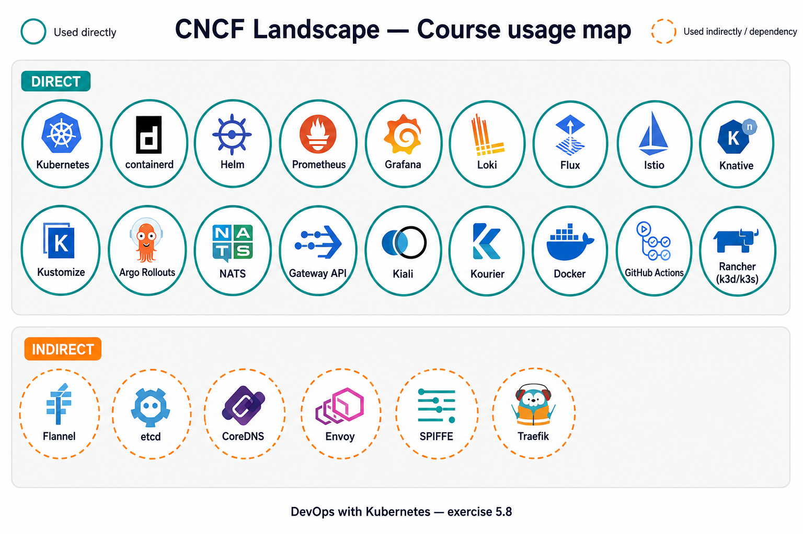

# Exercise 5.8 — CNCF Landscape

Reference: [CNCF Landscape](https://landscape.cncf.io/) ([PNG](https://landscape.cncf.io/images/landscape.png)).

## Legend

| Mark | Meaning |
|------|---------|
| **Teal / solid** | Used directly (I know I was using it) |
| **Orange / dashed** | Indirect dependency of something we used (not already in teal) |

Annotated summary map (course-oriented, not a pixel-perfect overlay of the full landscape poster):

## Used directly

- **Kubernetes** — every exercise; GKE + k3d clusters
- **containerd** — node runtime under k3s / GKE (also visible via `crictl` / k3d)
- **Docker** — building and pushing images for log-output, ping-pong, greeter, DummySite, etc.
- **Helm** — installed Prometheus / kube-prometheus-stack and related charts (monitoring, chapter 4–5)
- **Prometheus** — metrics / monitoring (exercise 4.3+); also wired for Kiali
- **Grafana** — dashboards with the Prometheus stack
- **Loki** (loki-stack) — logging stack on the local cluster
- **Flux** — GitOps for log-output and the todo project (4.7–4.10)
- **Kustomize** — overlays for staging/production/local/GKE configs
- **Argo Rollouts** — canary analysis for ping-pong (4.4)
- **NATS** — todo broadcaster pub/sub (4.6)
- **Istio** — ambient mesh for DummySite chapter demos / log app mesh (5.2–5.3)
- **Kiali** — mesh traffic graph for greeter split (5.3)
- **Knative** — Serving hello demos + serverless ping-pong (5.6–5.7)
- **Kourier** — Knative networking layer (5.6)
- **Gateway API** — HTTPRoutes / Gateways for mesh and tip for `/pingpong` rewrite
- **k3d / k3s** (Rancher) — local clusters throughout; dedicated Knative cluster
- **GitHub Actions** — CI for todo-app-code images (4.10)
- **kubectl** — day-to-day cluster control (Kubernetes tooling)

## Used indirectly (dependencies)

- **Flannel** — default CNI in k3s/k3d (pod networking); I did not configure it by hand
- **etcd** — Kubernetes control-plane datastore (GKE / k3s)
- **CoreDNS** — in-cluster DNS (`*.svc.cluster.local`, Knative FQDNs)
- **Envoy** — data plane behind Istio (ztunnel/waypoint path) and Kourier gateway
- **SPIFFE** — workload identities used by Istio ambient policies (5.2–5.3)
- **Traefik** — came with default k3d (Ingress) before the Knative cluster disabled it
- **kube-state-metrics / node-exporter** — pulled in by the Prometheus Helm chart

## Outside of the course

*(Add personal items here if needed — leave empty if none.)*

## Notes

- Depth is limited on purpose (e.g. k3d → k3s → Flannel), so the map stays meaningful.
- Rancher appears via **k3d/k3s**, not a full Rancher Manager install (see also exercise 5.5 comparison).
