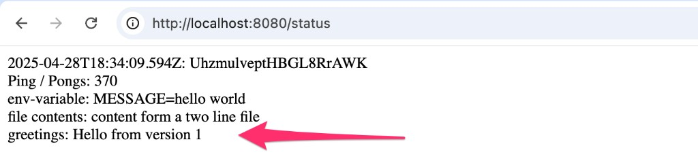
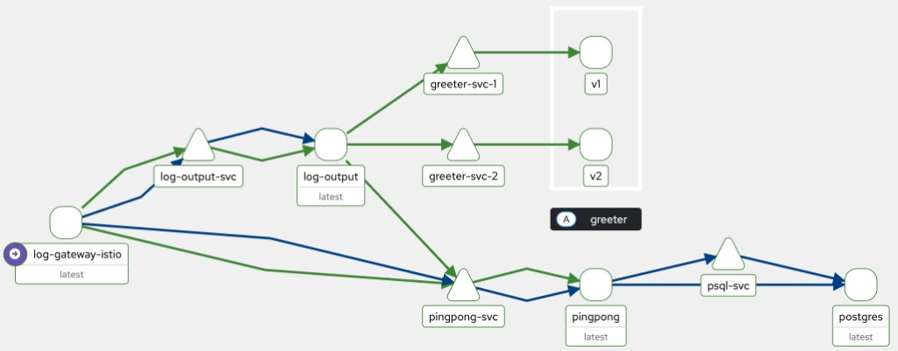

# Log output — Service Mesh Edition (5.3)

Log-output calls **greeter** (`http://greeter-svc:3000/`) and prints:

```text
greetings: Hello from version 1
```

Traffic to `greeter-svc` is split **75% v1 / 25% v2** via ambient waypoint + HTTPRoute (same pattern as [Istio manage traffic](https://istio.io/latest/docs/ambient/getting-started/manage-traffic/)).

## Prerequisites

1. Istio ambient on k3d (see [`../istio/README.md`](../istio/README.md)):

```powershell
istioctl install --set profile=ambient `
  --set values.global.platform=k3d `
  --set values.cni.cniConfDir=/var/lib/rancher/k3s/agent/etc/cni/net.d `
  --set values.cni.cniBinDir=/var/lib/rancher/k3s/data/cni `
  --skip-confirmation
```

2. Enroll `exercises` and create a waypoint (needed for L7 HTTPRoute):

```powershell
kubectl label namespace exercises istio.io/dataplane-mode=ambient --overwrite
istioctl waypoint apply -n exercises --enroll-namespace --wait
```

3. Kiali (optional) with existing Prometheus — [`../istio/kiali.yaml`](../istio/kiali.yaml)

## Deploy

```powershell
# Images
docker build -t msami936/log-output:5.3 ./log_output
docker build -t msami936/greeter:5.3 ./greeter
docker push msami936/log-output:5.3
docker push msami936/greeter:5.3

kubectl apply -f greeter/manifests/
kubectl apply -f log_output/manifests/   # or wait for Flux
```

## Verify

```powershell
kubectl port-forward -n exercises svc/log-gateway-istio 8080:80
# open http://localhost:8080/status
```

Example status output includes:

```text
greetings: Hello from version 1
```



Traffic check (approx 75/25):

```powershell
kubectl exec -n exercises deploy/log-output -c log-reader -- sh -c `
  "for i in $(seq 1 40); do wget -qO- http://greeter-svc:3000/; done"
```

Kiali traffic graph:

```powershell
istioctl dashboard kiali
```


