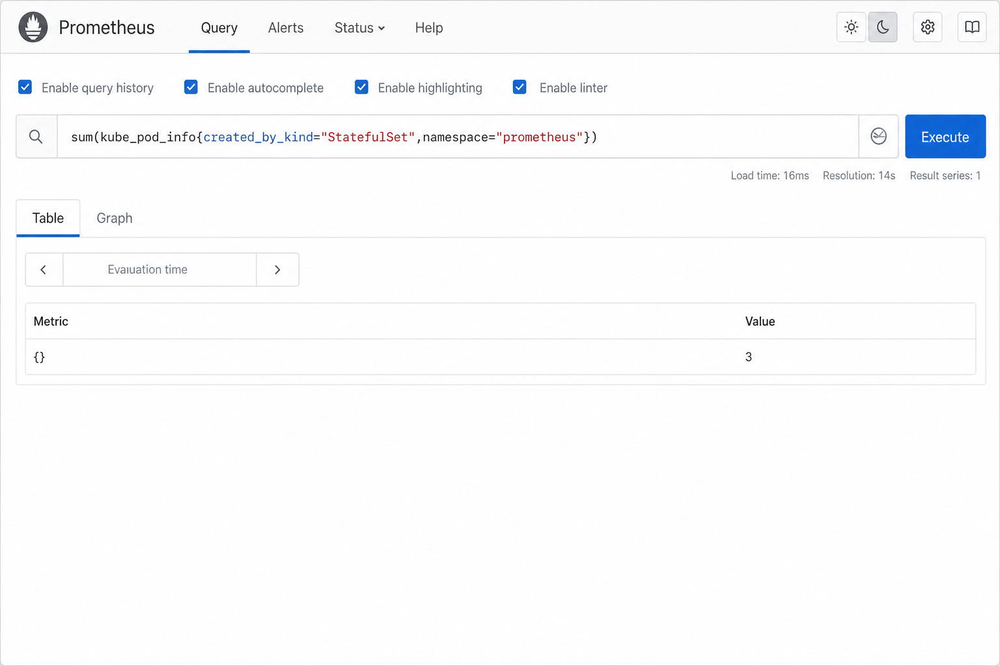

# Prometheus (exercise 4.3)

## Install with Helm

```bash
helm repo add prometheus-community https://prometheus-community.github.io/helm-charts
helm repo update

helm install prometheus prometheus-community/kube-prometheus-stack \
  --namespace prometheus \
  --create-namespace \
  --set grafana.enabled=false \
  --set prometheus.prometheusSpec.replicas=1 \
  --set alertmanager.alertmanagerSpec.replicas=2
```

(`alertmanager` replicas=2 + `prometheus` replica=1 → **3** StatefulSet pods in namespace `prometheus`.)

## Port-forward the Prometheus UI

```bash
kubectl -n prometheus get svc

kubectl port-forward svc/prometheus-kube-prometheus-prometheus -n prometheus 9090:9090
```

Open http://localhost:9090

## Query: StatefulSet pods in `prometheus`

Using [`kube_pod_info`](https://github.com/kubernetes/kube-state-metrics/blob/main/docs/metrics/workload/pod-metrics.md) and [PromQL basics](https://prometheus.io/docs/prometheus/latest/querying/basics/):

```promql
sum(kube_pod_info{created_by_kind="StatefulSet",namespace="prometheus"})
```

Expected value: **3**


